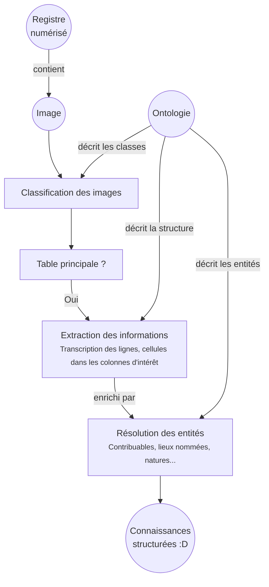

# IV. Extraction et structuration automatique des informations {data-short="IV. Extraction et structuration"}

## Processus

```mermaid
flowchart TB

    Cote((Registre<br>numérisé))
    Image((Image))
    Classifieur[Classification des images]
    Filtre[Table principale ?]
    ExtractionStructuree[Extraction des informations<br><small>Transcription des lignes, cellules dans les colonnes d'intérêt</small>]
    DetectionDesEntites[Résolution des entités<br><small>Contribuables, lieux nommées, natures...</small>]
    Ontologie((Ontologie))
    KG((Connaissances<br>structurées :D))

    Cote -- contient --> Image
    Image -->  Classifieur
    Classifieur --> Filtre
    Filtre -- Oui --> ExtractionStructuree
    ExtractionStructuree -- enrichi par --> DetectionDesEntites
    DetectionDesEntites --> KG
    Ontologie -- décrit les classes --> Classifieur
    Ontologie -- décrit la structure --> ExtractionStructuree
    Ontologie -- décrit les entités --> DetectionDesEntites
```

